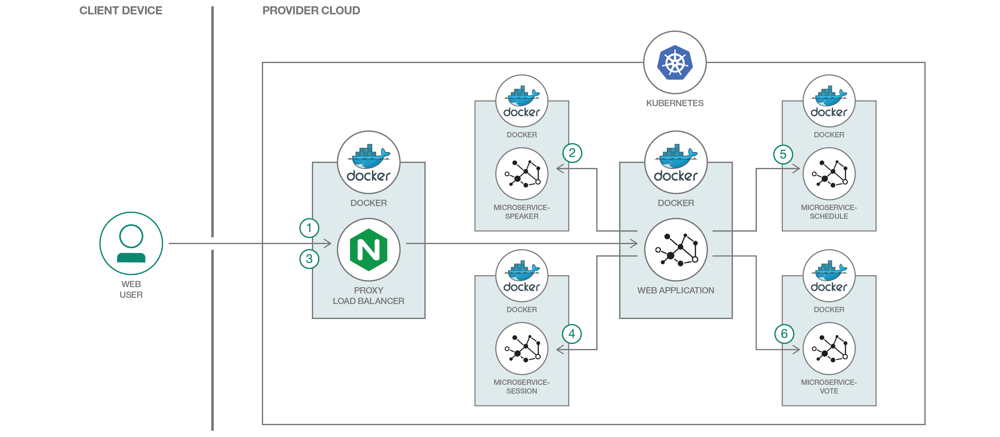
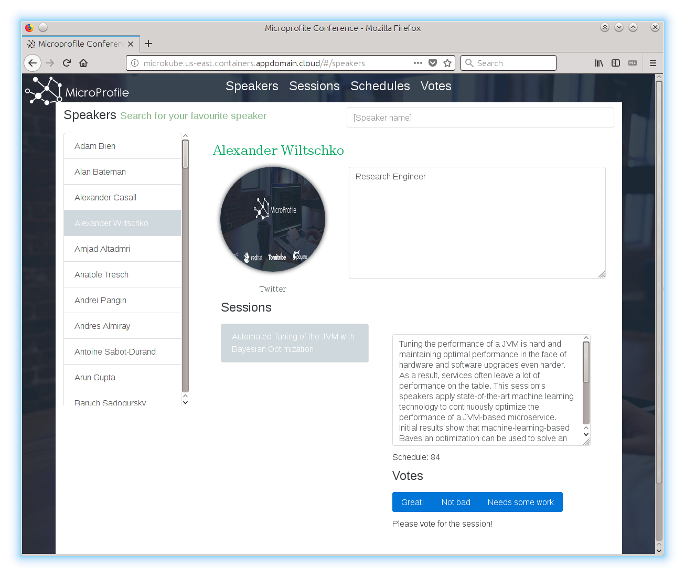

[](https://travis-ci.org/IBM/Java-MicroProfile-on-Kubernetes)

# Deploy MicroProfile based Java microservices on Kubernetes.

*Read this in other languages: [한국어](README-ko.md)、[中国](README-cn.md).*

This code demonstrates the deployment of a Java based microservices application using MicroProfile on Kubernetes.

[MicroProfile](http://microprofile.io) is a baseline platform definition that optimizes Enterprise Java for a microservices architecture and delivers application portability across multiple MicroProfile runtimes.

The [sample application](https://github.com/IBM/sample.microservices.web-app) used is a web application for managing a conference and is based on a number of discrete microservices. The front end is written in Angular; the backing microservices are in Java. All run on OpenLiberty, in Docker containers managed by Kubernetes.  It's based on a [demo application](https://github.com/eclipse/microprofile-conference) from the MicroProfile platform team.



## Included Components
- [Kubernetes Cluster](https://console.ng.bluemix.net/docs/containers/cs_ov.html#cs_ov)
- [MicroProfile](http://microprofile.io)
- [IBM Cloud Kubernetes Service](https://console.ng.bluemix.net/catalog/?taxonomyNavigation=apps&category=containers)

## Getting Started

### Kubernetes

In order to follow this guide you'll need a Kubernetes cluster. If you do not have access to an existing Kubernetes cluster then follow the instructions (in the link) for one of the following:

_Note: These instructions are tested on Kubernetes 1.10.5.  Your mileage may vary if you use a version much lower or higher than this._

* [Minikube](https://kubernetes.io/docs/getting-started-guides/minikube) on your workstation
* [IBM Cloud Kubernetes Service](https://github.com/IBM/container-journey-template#container-journey-template---creating-a-kubernetes-cluster) to deploy in an IBM managed cluster (free small cluster)
* [IBM Cloud Private - Community Edition](https://github.com/IBM/deploy-ibm-cloud-private/blob/master/README.md) for a self managed Kubernetes Cluster (in Vagrant, Softlayer or OpenStack)

After installing (or setting up your access to) Kubernetes ensure that you can access it by running the following and confirming you get version responses for both the Client and the Server:

```shell
$ kubectl version

Client Version: version.Info{Major:"1", Minor:"11", GitVersion:"v1.11.0", GitCommit:"91e7b4fd31fcd3d5f436da26c980becec37ceefe", GitTreeState:"clean", BuildDate:"2018-06-27T20:17:28Z", GoVersion:"go1.10.2", Compiler:"gc", Platform:"linux/amd64"}
Server Version: version.Info{Major:"1", Minor:"10", GitVersion:"v1.10.5+IKS", GitCommit:"7593549b33fb8ab65a9a112387f2e0f464a1ae87", GitTreeState:"clean", BuildDate:"2018-07-19T06:26:20Z", GoVersion:"go1.9.3", Compiler:"gc", Platform:"linux/amd64"}
```

## Steps

### 1. Clone Repository

First, clone our repository.
```shell
git clone https://github.com/IBM/Java-MicroProfile-on-Kubernetes.git
cd Java-MicroProfile-on-Kubernetes
```

### 2. Optional Step - Build Application

If you want to [build the application](docs/build-instructions.md) yourself now would be a good time to do that. However for the sake of demonstration you can use the images that we've already built and uploaded to the journeycode docker repository.

### 3. Deploy Microservices

Now, deploy the microservices with the commands:

If using Minikube / ICP run:
```shell
$ cd scripts
$ ./set-ingress-minikube.sh
```

If using IBM Cloud Kubernetes Service, run:

```shell
$ cd scripts
$ ./set-ingress-host [cluster name]
$ ./cloudant-secret.sh
```

Finally, deploy all microservices:

```shell
$ kubectl create -f manifests
persistentvolume "cloudant-pv" created
persistentvolumeclaim "cloudant-pv-claim" created
service "cloudant-service" created
deployment "cloudant-db" created
...
...
```

_Note: this will deploy all of the kubernetes manifests in the [manifests/](manifests/) directory. Take some time to explore their contents to get an idea of the resources being used to deploy and expose the app._

After you have created all the services and deployments, wait for 10 to 15 minutes. You can check the status of your deployment on Kubernetes UI. If using Minikube, run 'kubectl proxy' and go to URL 'http://127.0.0.1:8001/ui' to check when the application containers are ready.


After a few minutes you should be able to access the application. Part of our deployment is a [Kubernetes Ingress resource](manifests/deploy-ingress.yaml). If your Kubernetes cluster already has an ingress service such as IBM Cloud Private then you should be able to access the application with no further changes.

However if you are using minikube, or a Kubernetes cluster that does not have an ingress service you have one more step before you can access your cluster. On minikube you can do the following:

```shell
$ minikube addons enable ingress
ingress was successfully enabled
$ minikube ip
192.168.99.100
```

With an Ingress controller enabled you can access the app via the IP provided by minikube above.

If running on IBM Cloud Container Service, you will use the hostname to access the application, which
you can retrieve with the following:

```shell
$ kubectl get ing
NAME                   HOSTS                                          ADDRESS          PORTS     AGE
microprofile-ingress   microkube.us-east.containers.appdomain.cloud   ***.***.***.***   80, 443   1m
```


Now you can use the link **http://[Public URL]** to access your application in a browser.

Web application home page


When you click on speaker name



When you click on schedules link


When you click on vote link


## Troubleshooting

* If your microservice instance is not running properly, you may check the logs using
	* `kubectl logs <your-pod-name>`
* To delete a microservice
	* `kubectl delete -f manifests/<microservice-yaml-file>`
* To delete all microservices
	* `kubectl delete -f manifests`

## References
* This Java microservices example is based on Kubernetes [Microprofile Showcase Application](https://github.com/WASdev/sample.microservices.docs).
